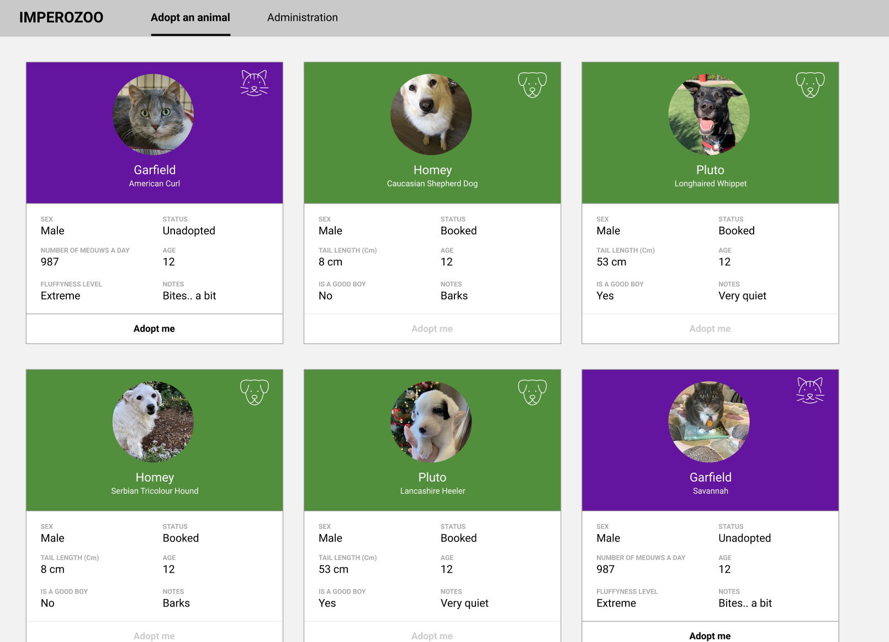
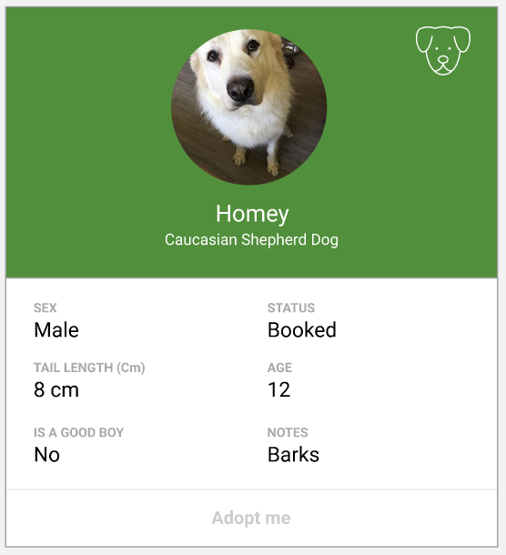
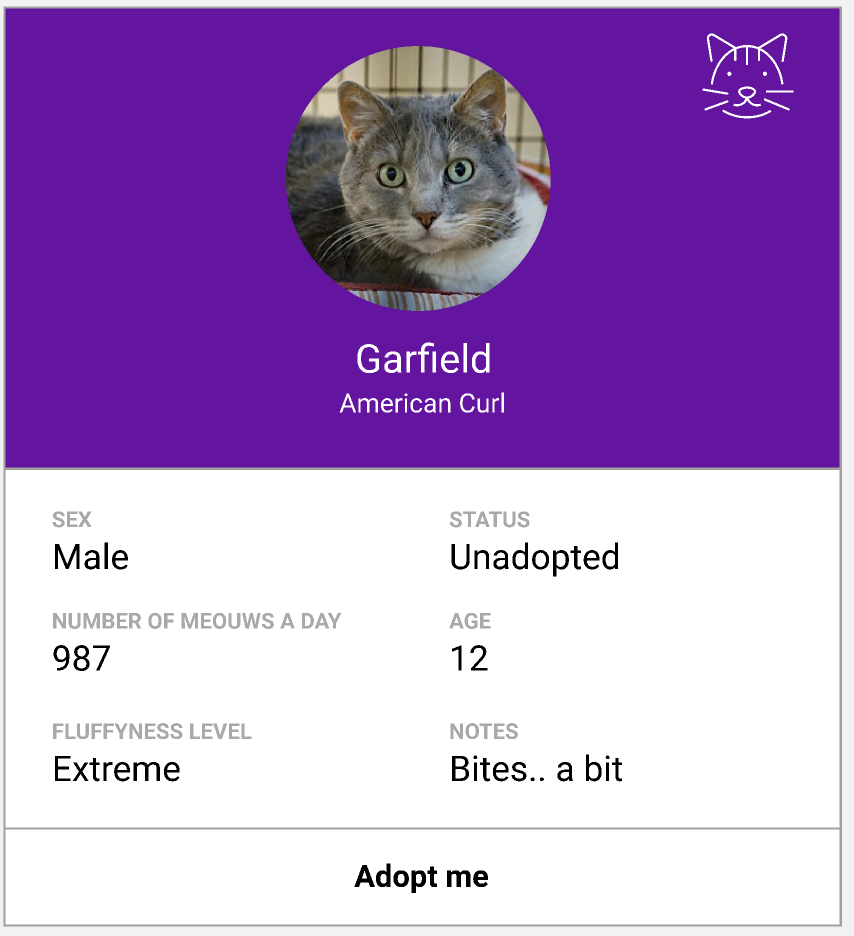
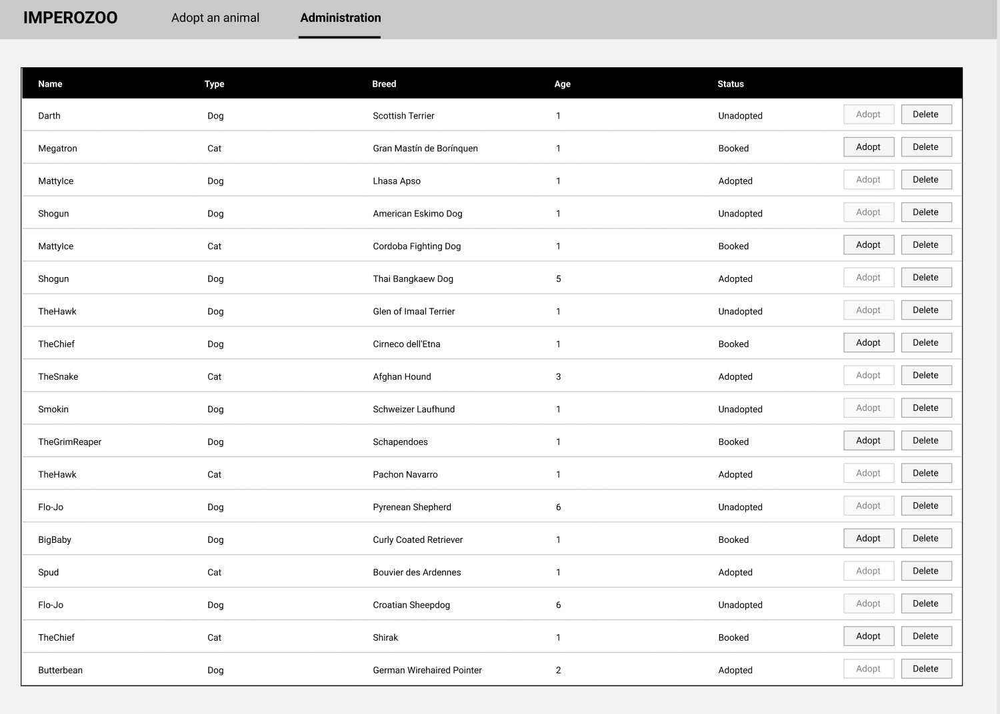

# Impero frontend test

Welcome to the Impero front-end test !
Read those instructions carefully before you start, including the notes at the end. 

# Goal

The goal of this short test is to show your ability to implement a small application using web technologies. It will show how you approach problems, then we can discuss it with you during your next interview. We will care about:

* Your fluency with our front-end stack (React + TypeScript, react-router, scss)
* How you reason about the typing in a given scenario
* Your ability to implement an UI given a mockup
* Your attention to details and respect for UI/UX

You will implement an application for a fake animal shelter. Users will have two screens, where they can:

* Add and remove an animal profile to the list
* See all profiles and adopt an animal from the list

Authentication is **out of scope** for this exercise.

# Instructions

## Basic setup

* Create a React application
* Use TypeScript and JSX (.tsx files)
* Setup unit tests as you wish (see "bonus points")
* Use react-router to handle navigation through the application
* You don't need to handle the backend yourself. We have prepared a `db.json` file for you (in the `assets` folder). You must use [json-server](https://github.com/typicode/json-server) to get a full REST API.
    * Install it with `npm i -g json-server` (you might need to use `sudo`)
    * Run it with `json-server --watch db.json`
    * Leave it to run on port 3000
* We advise you to read the `db.json` file carefully and understand the structure of the (fake) database
* As you will use Typescript, show us how you would use the typesystem to your advantage in this particular case

## Domain language

For the scope of this application, an animal is either a *Cat* or a *Dog*.

An *animal* has various attributes
* Name
* Sex (Male - Female)
* Breed
* Age (stored as the timestamp of the birth of the animal, format YYYY-MM-DD)
* A link to their photo
* Status (Booked - Adopted - Unadopted)
* An optional note - comments on that animal

A *dog* has various attributes, that are unique to it :
* Whether or not it is a good boy/girl (depending on its sex)
* The tail length in centimeters

A *cat* has various attributes, that are unique to it :
* Number of meows a day on average
* Fluffyness level : an integer from 1 to 4.
    * 1 = Below average
    * 2 = Average
    * 3 = More than average
    * 4 = Extreme

The action of *Booking ("to book")* an animal means to change their status from Unadopted to Booked. You can *not* book an animal that's Adopted or Booked.

The action of *Unbooking ("to unbook")* an animal means to change their status from Booked to Unadopted. You can *not* unbook an animal that's Unadopted or Adopted.

The action of *Adopting ("to adopt")* an animal means to change their status from Booked to Adopted. You can *not* adopt an animal that's Unadopted or Adopted.

The *Animal list* is the list that contains all animals, disregarding their statuses.

The *Adoptable list* is the list that contains all animals where the status is either Unadopted or Booked.

## Commons

There should be a header (non-sticky), that looks like this.

* The first item of the navbar leads to the screen "Adopting an animal" and is also the default page, the URL should be `/`. 
* The second item of the navbar leads to the screen "Administration". The URL should be `/administration`

This navbar should be handled by react-router and both pages should be separate components.

## Screen : Adopting an animal

This screen shows the *adoptable list*. Each *animal* is to be shown with a profile component as shown below, that varies depending on its type (see the animal definition).

All profiles shall be displayed in a list, eventually looking like the sketch below.

The user can click on the button below the profile to *book* an animal, or *unbook* it (depending on the status of the animal). Of course, booking an animal must use the REST API provided by `json-server` to persist those changes on the backend. An user shall only be able to book *one* animal to prevent spam. An error message needs to be displayed if the user tries to book more than one animal. (Yes, this is only a front-end protection so it is not secure, but that's beside the point). There is **no need** for this protection to resist a page refresh.

### Dog profile

A dog's profile looks like this

### Cat profile

A cat's profile looks like this

## Screen : Administration

This screen shows the *animal list*. Each animal is shown in a line of a table. This page is supposedly only accessed by admins, but we do not care about authentication here, so anyone can access it.

The list shall look like this :

### Deleting an animal

Clicking on the delete icon at the end of the table deletes the animal from the list. The list should then be reloaded.

### Adopting an animal

Clicking on "Adopt" will *adopt* the animal. 
Note that the button to adopt should be disabled if the status of the animal is "Unadopted" or "Adopted".  

## Bonus points (we appreciate your efforts, but don't ruin your weekend!)

* Write unit tests for whatever part of your code you feel applicable
* Use any CSS framework you like, add animations, as long as it looks like the mockup
* Show us that you are careful about responsiveness
* The front-end protection to avoid an user booking all our shelter can be changed to resist a page refresh

# Notes

* You will find an `assets` folder containing everything you need (the db.json file, and the icons for the mockup)
* The endpoints that you will likely be interested in are : 
    * `GET localhost:3000/animals/<id>` to retrieve an animal's definition
    * `PATCH localhost:3000/animals/<id>` to change an animal's info 
    * `DELETE localhost:3000/animals/<id>` to delete an animal
* Feel free to use any HTTP client - we typically use [axios](https://github.com/axios/axios), but the choice is yours
* Feel free to use any framework you like for front-end - we typically use [antd](https://github.com/ant-design/ant-design), but the choice is yours
* We don't expect you to spend more than 3 hours on this test. If all features are not implemented, it is **not** a problem.

Good luck !
